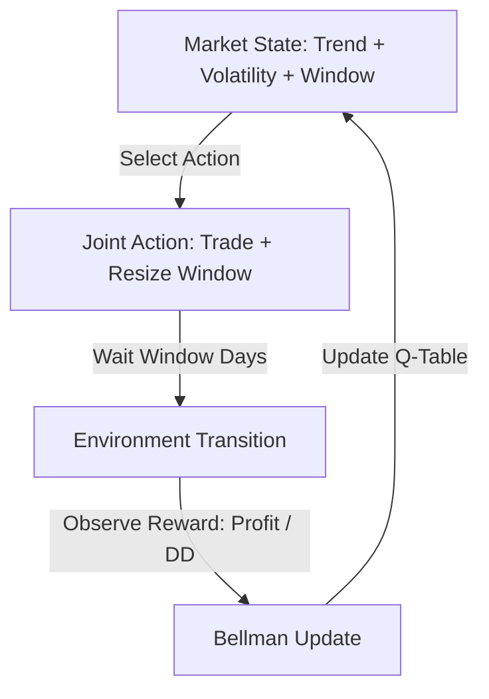

# Self-Optimizing Tabular Q-Learning Expert Advisor (RL_DynamicWindow)

This README provides an in-depth, technical exploration of the native MQL5 Reinforcement Learning (RL) Expert Advisor. It documents the underlying theory, decision-making dynamics, and operational mechanics of the strategy.

---

## 1. Executive Summary: Why It Learns

In traditional quantitative finance, trading strategies suffer from **regime drift**. A set of parameters (such as entry thresholds, moving average periods, or holding durations) optimized for a high-volatility, mean-reverting market will inevitably degrade and cause drawdowns when the market transitions into a low-volatility, trending phase.

Most traders attempt to solve this by periodically re-optimizing their Expert Advisors (EAs) using historical backtests (e.g., walk-forward optimization). However, this manual optimization is slow, static, and backward-looking.

**This EA is designed to solve parameter degradation on-the-fly.** It does this by combining two layers of decision-making into a single Reinforcement Learning agent:
1. **Trading Action:** Choosing whether to be Buy (Long), Sell (Short), or Flat.
2. **Meta-Action (The Window size):** Dynamically adjusting the size of its own evaluation and lookback window.

By learning its own optimal evaluation window, the agent changes the speed at which it adapts. In rapidly changing, high-volatility regimes, the agent can reason that a shorter window (e.g., 3 days) is required to avoid holding toxic positions. In stable, long-term trends, it can expand its window (e.g., 14 days) to filter out noise, capture larger absolute swings, and minimize transaction costs.

---

## 2. The Core Architecture: What It Learns

The agent operates in a closed-loop system where it maps environment states to actions and updates those associations based on experienced rewards.

### The State Space ($S$)
The state space represents a snapshot of both the market conditions and the agent's current internal configuration. It is discretized into $2 \times 3 \times 5 = 30$ unique states:

1. **Trend State (2 States):**
   * **State 0 (Bearish/Neutral):** Current Close Price $<$ SMA 200.
   * **State 1 (Bullish):** Current Close Price $\ge$ SMA 200.
2. **Volatility State (3 States):**
   * Calculated using the ratio $\text{Volatility Ratio} = \frac{\text{ATR(14)}}{\text{Close}}$.
   * **State 0 (Low Volatility):** Ratio $<$ `InpVolThresholdLow`
   * **State 1 (Medium Volatility):** `InpVolThresholdLow` $\le$ Ratio $<$ `InpVolThresholdHigh`
   * **State 2 (High Volatility):** Ratio $\ge$ `InpVolThresholdHigh`
3. **Window Size State (5 States):**
   * The index of the current active evaluation window: `3, 5, 7, 10, or 14` trading days.

### The Action Space ($A$)
The agent takes a joint action consisting of a trading decision and an architectural adjustment. There are $3 \times 3 = 9$ possible joint actions:

* **Trading Component:**
  * `ACTION_FLAT` (0): Close any active trade, remain flat.
  * `ACTION_BUY` (1): Open a BUY trade (or hold if already BUY).
  * `ACTION_SELL` (2): Open a SELL trade (or hold if already SELL).
* **Window Adjustment Component:**
  * `WINDOW_DECREASE` (0): Shift the evaluation window down one step (e.g. from 7 days to 5 days).
  * `WINDOW_HOLD` (1): Keep the current evaluation window size.
  * `WINDOW_INCREASE` (2): Shift the evaluation window up one step (e.g. from 7 days to 10 days).

The joint action is mapped to a single integer $a \in [0, 8]$ using division and modulo:
$$\text{TradeAction} = \lfloor a / 3 \rfloor$$
$$\text{WindowAction} = a \pmod 3$$

### The Q-Table Size
The mapping of states to actions is stored in a 4-dimensional matrix of size $[2][3][5][9]$, representing **270 distinct state-action values (Q-values)**. Each Q-value represents the agent's estimate of the long-term cumulative reward of taking action $a$ when in state $s$.

---

## 3. The Learning Mechanism: How It Learns

The agent uses **Tabular Q-Learning**, a model-free, off-policy Temporal Difference (TD) learning algorithm.

### The Bellman Optimality Equation
When a lookback window expires, the agent calculates the reward $R$ obtained during that window and observes the new state $s'$. It then updates the Q-value of the starting state $s$ and selected action $a$ using the Bellman equation:

$$Q(s, a) \leftarrow Q(s, a) + \alpha \left( R + \gamma \max_{a'} Q(s', a') - Q(s, a) \right)$$

Where:
* **$\alpha$ (Learning Rate, `InpAlpha`):** Controls how much the new feedback overrides the old Q-value. If $\alpha = 0.1$, the agent shifts its estimate by 10% toward the newly observed return.
* **$\gamma$ (Discount Factor, `InpGamma`):** Controls the agent's horizon. A value of $0.9$ means the agent prioritizes near-term rewards but places substantial weight on the potential value of the next state.
* **$\max_{a'} Q(s', a')$:** The maximum Q-value achievable in the next state, representing the agent's expectation of future performance from that state forward.

### The Reward Function
To prevent the agent from taking reckless trades or simply lengthening the window to collect larger absolute gains (which carry higher drawdown), the reward is risk-adjusted:

1. **Drawdown Ratio Scaling:**
   If $\text{Net Profit} \ge 0$, the reward is:
   $$\text{Reward} = \frac{\text{Net Profit}}{\text{Max Drawdown}}$$
   This encourages high-return, low-drawdown actions (similar to a Sharpe or Sterling Ratio).
2. **Negative Performance Penalty:**
   If $\text{Net Profit} < 0$, dividing by drawdown would mathematically make larger drawdowns look "less negative" (e.g., $-100 / 10 = -10$ vs. $-100 / 50 = -2$). To fix this anomaly, the reward is:
   $$\text{Reward} = \text{Net Profit} - \text{Max Drawdown}$$
   This heavily penalizes losing actions that experience large equity drawdowns.
3. **Transaction Cost Penalty:**
   To prevent rapid buying and selling (which generates high broker costs), a penalty is applied for every trade opened during the window:
   $$\text{Reward} \leftarrow \text{Reward} - (\text{Trades Count} \times \text{InpTradePenalty})$$

---

## 4. Rule Formation and Reasoning

In tabular reinforcement learning, "rules" are not hardcoded IF-THEN statements. Instead, they are emergent behaviors represented by the relative weights in the Q-table.

### How the Agent Reasons Through New Rules
1. **Rule Initialization:** At startup, all Q-values are initialized to 0.0. The agent has no rules.
2. **Exploration vs. Exploitation (Epsilon-Greedy):**
   * **Exploration ($\epsilon$ probability):** The agent takes a completely random action. This allows it to discover new behaviors and map out previously unvisited areas of the state-action space.
   * **Exploitation ($1 - \epsilon$ probability):** The agent looks at the Q-values for its current state $s$ and selects the action $a$ with the highest Q-value.
3. **Emergence of Rules:**
   Suppose the agent is in state $s = (\text{Trend}=1, \text{Volatility}=0, \text{Window}=2)$—representing a low-volatility uptrend with a 7-day lookback window.
   * If it takes a BUY action combined with a HOLD window action, it is highly likely to make money with low drawdown. The resulting positive reward increases the value of $Q(s, \text{Buy-Hold})$.
   * If it takes a SELL action in this state, it loses money. The negative reward decreases the value of $Q(s, \text{Sell-Hold})$.
   * Over time, $Q(s, \text{Buy-Hold})$ becomes significantly larger than $Q(s, \text{Sell-Hold})$.
   * The emergent rule is: **"When the market is in a low-volatility uptrend, buy and hold a 7-day window."**

### Tie-Breaking: How It Begins to Learn
At the very beginning of learning, all Q-values in the state row are 0.0. A naive exploitation algorithm would always choose action index 0 (`FLAT` + `DECREASE WINDOW`), getting stuck in a feedback loop where it never trades and shrinks its window to the minimum size.

To prevent this, the EA implements **random tie-breaking**:
* If multiple actions share the maximum Q-value (which is common during the early stages of training), the agent builds an array of all winning actions and selects one at random.
* This ensures that the agent actively tries different actions in the early stages, speeding up the discovery of profitable rules.

---

## 5. Formulating and Prioritizing Rules

The agent is constantly evaluating and competing different rules against each other.

### The Competition of Rules
For any given state, there are 9 competing rules (actions). The agent prioritizes these rules based on their expected Q-values:

* **Short-Term vs. Long-Term Windows:**
  Suppose the market enters a high-volatility downtrend ($\text{Trend}=0, \text{Volatility}=2$).
  * If the agent operates on a 14-day window (`Window=4`), it might hold a sell position too long through a volatile pullback, leading to a massive drawdown. The reward for this action will be very low (e.g. -200.0).
  * If the agent shifts to a 3-day window (`Window=0`), it can quickly close the trade or switch directions as soon as the market bounces, resulting in a much smaller drawdown and a better reward (e.g. -20.0).
  * Over multiple iterations, the Q-values for actions that **decrease** the window size when in high volatility will grow larger than actions that hold or increase it.
  * The agent thus learns the meta-rule: **"If volatility is high, shrink the evaluation window to react faster."**

* **Convergence and Exploitation:**
  As the backtest or live trading progresses:
  * Profitable rules (high reward / low drawdown) accumulate high positive Q-values.
  * Unprofitable rules (losses or high drawdown) accumulate negative Q-values.
  * The agent progressively reduces its random exploration (though keeping a baseline $\epsilon=0.2$ or lower) and spends more time executing the high-value rules.
  * The Q-table converges to a state where the agent has a distinct, specialized trade direction and window configuration for every market regime.

---

## 6. Binary Persistence: Keeping the Knowledge

Since learning takes time (requiring exposure to multiple market cycles), it is crucial that the agent does not lose its Q-table when the terminal restarts or when a backtest ends.

* **On Deinitialization (`OnDeinit`):** The EA serializes the entire 4D `QTable` array into a single binary file in the MetaTrader Common Files sandbox:
  `C:\Users\<user>\AppData\Roaming\MetaQuotes\Terminal\Common\Files\RL_DynamicWindow_QTable_<Symbol>_<Period>_<MagicNumber>.bin`
* **On Initialization (`OnInit`):** The EA checks if this binary file exists. If it does, it reads the array directly back into memory using `FileReadArray`. This restores the Q-table to its exact pre-shutdown state, preserving all learned weights.
* **Why Symbol, Period, and Magic Number are in the filename:** This isolates the learning process for different settings. If you run the EA on `EURUSD H1` and `GBPUSD D1` simultaneously, they will maintain separate, independent binary Q-tables, ensuring that the rules learned for one symbol or timeframe do not overwrite or corrupt the rules learned for another.
